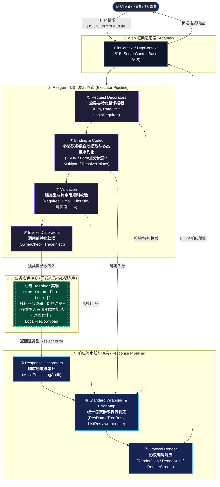

# resgen 🚀

**`resgen` 不仅仅是一个提效工具，它更是一套内嵌了行业最佳实践的 API 设计标准与生命周期规范。** 它定义了一套极简、强类型且极具表现力的 **DSL (Domain Specific Language) 语法**，旨在解决 RESTful API 开发中契约不一致、文档滞后及类型安全缺失的痛点。

虽然目前首发支持 Go 语言，但 `resgen` 的设计架构是语言无关的，可以轻松扩展以支持 Java、TypeScript、Python 等多种语言的代码生成。

## 🎯 核心特性

- **标准设计规范**：定义了一套跨语言的 API 描述标准（DSL），让接口定义成为唯一的真理来源。
- **极简接口表达**：抛弃繁重的配置，直接融合 HTTP 语义与方法映射，如 `GET /users => GetUsers()`。
- **强大的数据建模**：继承了类 GraphQL 的模型定义（`type`/`input`/`wrap`）带来的结构化体验。
- **高性能、全生成**：拒绝运行时的反射性能损耗，所有路由分发与参数解析代码均为静态生成（Go 语言实现中已达到极致性能）。
- **语言无关，易于扩展**：核心是解析 DSL 产出的标准 AST/JSON，可以快速适配不同语言的框架或存根生成。
- **交互式文档集成**：自动生成极其美观且功能完备的交互式 API 文档，确保契约即文档。

## 🏗️ 业务处理全景架构图 (Execution Lifecycle)

Resgen 负责搞定 90% 的网络协议、数据绑定、安全校验和统一包装的脏活累活，让业务开发人员把 100% 的精力聚焦在最核心的业务逻辑上：



### 🎯 开发人员切入点 (Developer Entry Points)

| 切入阶段 | 核心任务 | 开发人员职责 |
| :--- | :--- | :--- |
| **1. 契约设计** | 编写 `.res` Schema 文件 | 声明接口路径、入参、出参、包装器、校验规则及安全装饰器。 |
| **2. 业务实现** | **实现 `XxxResolver` 接口 (🌟 核心)** | **90% 的日常工作**：编写纯粹的 Go 业务逻辑，无需处理任何 HTTP 底层细节。 |
| **3. 通用切面** | 实现 `Decorator` / `Validator` | 注入项目级通用鉴权（如 `@auth`）、限流或业务校验逻辑。 |
| **4. 统一响应** | 实现 `Responder` 契约 | 自定义统一的错误码映射与 `ResData` / `TreeRes` 包装结构装配。 |
| **5. 宿主集成** | 在 `main.go` 中挂载引擎 | 通过 `MountXxx` 一键挂载到 Gin、Echo 或标准库 HTTP 引擎中。 |

### 💡 核心优化亮点 (Key Innovations)

- **0 反射静态生成**：所有路由分发、参数提取、校验全部编译期静态生成，无运行时反射开销。
- **按需 Tag 精准推导**：基于端点实际使用的 `ctype`/`etype` 全集生成 Tag，模型极致纯净无污染。
- **多协议天然正交**：JSON、Form（支持 `address.city` 点语法嵌套）、Multipart、XML、Stream 流式传输统一支持。
- **强类型文件下载**：出参返回 `File` 自动绑定强类型载体 `*LocalFileDownload` 与 `RenderStream`。
- **树形自引用与防死锁**：内置 `TreeRes<T>` 包装器，API 文档智能识别自引用树结构，防止页面无限递归。
- **极速代码定位 (HandlerPos)**：控制台日志输出处理器源码行号，点击即可直达代码实现。

## 📦 内置数据类型 (Built-in Data Types)

Resgen DSL 原生支持以下基础数据类型，引擎会自动将其映射到目标编程语言的对应类型：

- `String`：字符串
- `Int`：整数数值
- `Float`：浮点数值
- `Boolean`：布尔值
- `File`：文件类型（支持 Multipart 表单文件上传或 Stream 下载流）
- `Any`：任意类型（未知或动态结构的逃生舱，底层映射为 Go 语言的 `any`）
- `Field`：字段引用类型（专用于校验器参数声明，用于动态捕获并对比结构体中的其他字段。**⚠️ 警告：坚决不能作为普通 `type`/`input`/`wrap` 等模型中的属性字段类型！若需表达动态结构，请选用 `Any`**）

> 💡 **类型修饰符**：支持 GraphQL 风格的修饰符。类型后追加 `!` 表示非空（必填），使用 `[]` 声明数组。例如 `[String!]!` 代表一个必定存在且内部元素不可为空的字符串列表。

## 📖 语法一瞥 (DSL at a glance)

只需下面如此清晰的几行定义，`resgen` 便能为你产出整个项目的骨架：

```graphql
# 声明路由修饰器与数据验证规则，享受强类型校验
decorator @auth(role: String!)
validator @phone
validator @timeBefore(targetField: Field!)  # 声明高级跨字段校验器

# 【亮点】定义统一的跨语言泛型格式包装器 (Wrapper)
wrap ResData<T> {
    code: Int!
    msg: String!
    data: T
}

# 定义基础数据结构
type TaskPeriod {
    startTime: IntTime! @timeBefore("endTime")  # 优雅的跨字段关联校验，编译器智能识别！
    endTime: IntTime!
}

type User {
    id: Int!
    username: String!
    phone: String!
}

# 【亮点】编排 API 网络，灵活控制状态码与前后端交互格式 (Content-Type)
group /api/v1 [wrap=ResData] {  # 组级应用默认响应包装器
    
    # 基础路由与组件装饰，成功时返回 200 与 JSON
    @auth("admin")
    GET /users => GetUsers(page: Int, size: Int): ResData<[User!]!> [state=200, ctype=json]
    
    # 精细控制：成功时下载文件流(ctype=stream)，失败时安全退化为标准的 JSON 错误响应(etype=json)
    GET /users/export => ExportUsers(date: String!): File [ctype=stream, etype=json]
}
```

## 📚 项目文档

为了帮助你更好地深入了解 Resgen，我们准备了以下详尽文档：

- [**DSL 语法全指南**](./docs/dsl_guide.md)：探索如何定义模型、包装器与复杂的接口网络。
- [**响应处理机制**](./docs/response_handling.md)：深入理解错误映射、状态码控制与统一响应契约。
- [**项目阶段总结**](./docs/project_summary.md)：了解 Resgen 的最新特性与架构演进。

## ⚡ 快速开始

1. **安装工具**：`(go install github.com/xslasd/resgen@latest)`
2. **编写 Schema**：创建一个 `.res` 文件。
3. **配置 `resgen.yaml`**：
   ```yaml
   generator:
     package: "resolver"
     enable_api_docs: true  # 开启全自动 API 文档生成
   ```
   > 💡 **提示**：`resgen` 默认从当前目录加载 `resgen.yaml`。如果文件不存在，将使用内置默认配置。你也可以通过 `-c` 或 `--config` 参数指定配置文件路径。
4. **一键生成**：`resgen generate -f ./schema -o ./resolver`
5. **注入业务**：实现生成的 `Resolver` 接口即可。

## 🎨 自动集成 API 文档

当你在 `resgen.yaml` 中开启 `enable_api_docs: true` 时，`resgen` 会为你做以下工作：

1. **自动生成资源**：在输出目录生成 `docs/api.html` 和 `docs/api.json`。
2. **内置路由绑定**：生成的 `Engine` 会自动挂载以下路由：
   - `GET /docs`：交互式 API 预览页面（基于 Tailwind CSS，极简美观）。
   - `GET /docs/json`：原始 API 定义数据。
3. **零配置使用**：在你的 Web 框架中只需正常绑定 `Register` 回调，文档便会自动生效，无需额外手动操作。

```go
// 示例：在 Gin 中集成
en := resolver.NewEngine[*GinContext]().
    BindRegister(func(e *resolver.Engine[*GinContext], info resolver.MethodInfo, handler resolver.HandlerFunc[*GinContext]) {
        // 文档路由 (/docs) 也会通过此回调自动注册到 Gin
        r.Handle(info.Method, info.Path, func(ctx *gin.Context) {
            handler(&GinContext{GC: ctx}, info)
        })
    })
```
